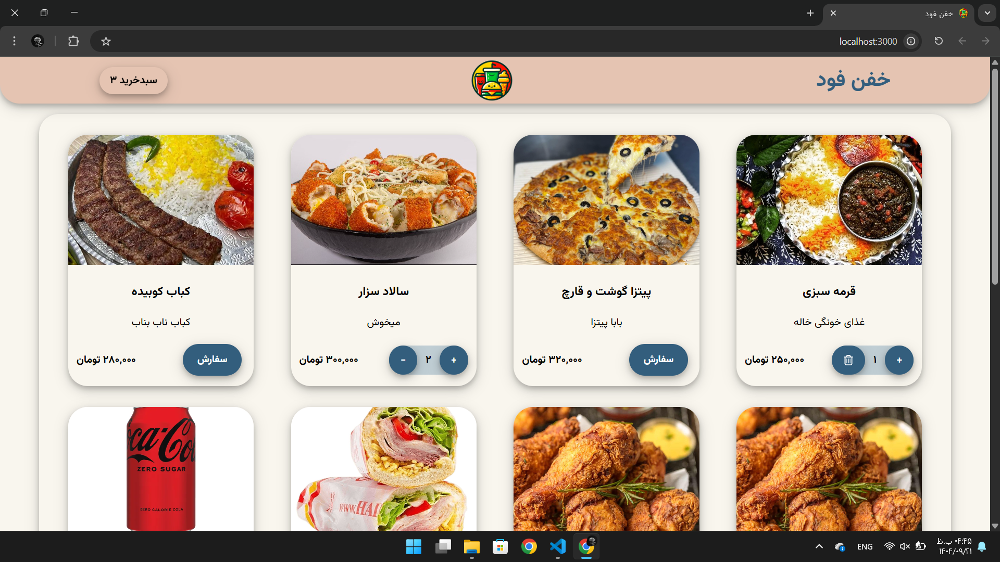
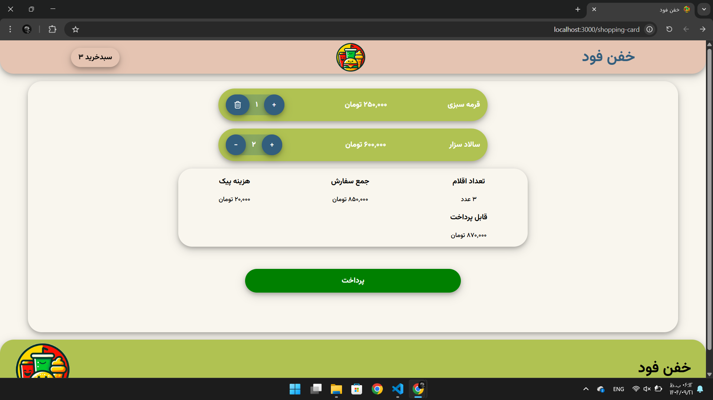
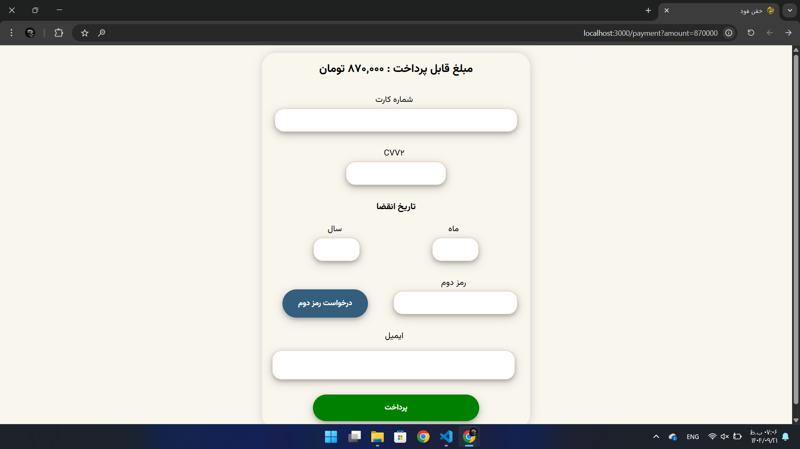

# 🥘 Khafan Food — Online Food Ordering Website

A full-featured **online food ordering web app** built with **React 18**, focusing on **great UX, clean code, and fast performance**.  
(No external UI frameworks — everything handcrafted and lightweight!)


---


## 🏠 About the Project

**Khafan Food** is a complete online food ordering platform where users can:

- Browse and add foods to the cart
- Increase, decrease, or remove items
- View cart with automatic total + delivery fee
- Fill a simulated payment form with full validation
- Receive notifications after successful payment, and the cart is emptied

**Project goal:** Demonstrate mastery of React, global state management, custom hooks, routing, and professional UX — using only React core tools.


---


## 🔗 Live Demo

[View Live Demo](https://melodic-frangipane-50c1eb.netlify.app/)


---


## 🖼 Screenshots

|                Home Page                |                  Shopping Page                  |               Payment Page               |
|-----------------------------------------|-------------------------------------------------|------------------------------------------|
|  |  |  |


---


## ✨ Features

- Add / decrease / remove items from the cart (trash icon shows when only 1 item left)
- Total item count on the cart button in top navigation
- Cart page with automatic total calculation + 20,000 Toman delivery fee
- Simulated payment form with full validation
- “Request OTP” button with 120-second countdown
- Notification system using React Portal with 4 types (success, error, warning, info)
- Fully responsive and mobile-first
- Custom 404 page
- Reusable components (Button, Input, AddAndRemoveItem, etc.)


---


## 🧩 Tech Stack

| Technology                       | Purpose                              |
| -------------------------------- | ------------------------------------ |
| React 18 + Hooks                 | App structure & logic                |
| React Router v6                  | Page routing                         |
| Context API                      | Global state (cart & notifications)  |
| CSS Modules                      | Isolated and clean styling           |
| React Portal                     | Notifications without z-index issues |
| Custom Hooks (useInputValidator) | Form validation logic                |

_No extra UI libraries — pure React!_


---


## ⚙️ Installation

```bash
# Clone the repository
git clone https://github.com/AmirNouaparast/khafan-food.git
cd khafan-food

# Install dependencies
npm install

# Run development server
npm start
```
Open your browser at: http://localhost:3000


---


## 📂 Project Structure

```bash
src/
├── components/ # Reusable UI components
├── pages/ # Main pages (Home, Cart, Payment, NotFound)
├── util/ # Custom hooks & helper functions
├── foods.js # Static food data
├── appContext.jsx # Context + cart logic
├── App.jsx # Routing
└── index.js # App rendering
```

---


## 💡 Highlights for Interviews

Smart use of JSON.parse(JSON.stringify()) for deep copy in Context (prevents direct mutation)
Custom hook useInputValidator with full configuration (min/max length, onlyNumbers, required, etc.)
Notification system with auto timeout + React Portal
Automatic price formatting (250000 → 250,000 Toman)
Highly flexible Button component (size, variant, color, fullWidthOnMobile, etc.)
Excellent mobile UX (large buttons, proper spacing, trash icon for single items)


---


## 👨‍💻 Author

Amir Nouaparast  
GitHub: [Amir Nouaparast](https://github.com/AmirNouaparast)  
Frontend Developer | React Enthusiast | Lover of Clean Code & Strong Coffee ☕

